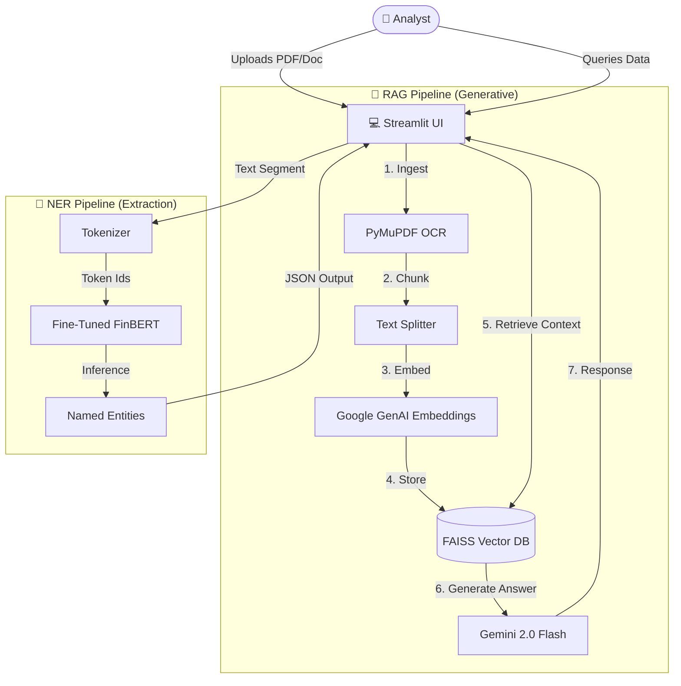

# ⚡ FinanceInsight

<div align="center">The bridge between unstructured financial text and actionable intelligence.</div>

---

## 📖 Overview

FinanceInsight is an enterprise-grade AI assistant for financial analysts. It combines Retrieval-Augmented Generation (RAG) with a fine-tuned Named Entity Recognition (NER) model to let you:

- Chat with 10-K filings, earnings transcripts, PDF decks, or market news.
- Instantly surface grounded answers with citations.
- Auto-extract over 139 domain-specific financial metrics without manual sifting.

## 🏗️ System Architecture

FinanceInsight operates on a dual-pipeline architecture: a semantic RAG workflow for Q&A and a specialized FiNER-139 pipeline for precise metric extraction.



## 🚀 Key Features

| Feature | Description | Tech Stack |
| --- | --- | --- |
| Interactive Chat | Ask natural-language questions about leverage, risks, or revenue streams. | LangChain + Gemini |
| Smart Caching | Upload once, query forever with cached FAISS vector stores. | FAISS + Pickle |
| Precision Extraction | Tag and export 139+ granular financial entities. | FiNER-139 + FinBERT |
| Citation Backing | Every response links back to the exact document chunk. | RAG Guardrails |
| Glassmorphism UI | Clean Streamlit app designed for long-form analysis. | Streamlit + custom CSS |

## 🎖️ Intelligence Core: FiNER-139

FinanceInsight’s extraction accuracy is powered by a custom model trained on the FiNER-139 dataset—built specifically for Financial Numeral Entity Recognition.

- **Source:** 10-K filings, investor reports, and regulatory disclosures.
- **Granularity:** 139 gold-standard tags (e.g., `DebtInstrumentInterestRate`, `Revenue`, `EarningsPerShare`).
- **Use Case:** Produces structured JSON outputs for downstream analytics.

## ⚙️ Training Highlights

1. **Label Discovery** – Automated scanning of `.jsonl` corpora to enumerate all entity tags.
   ```python
   unique_ner_tags = set()
   for example in dataset["train"]:
       unique_ner_tags.update(example["ner_tags"])
   ```
2. **Robust Tokenization** – `tokenize_and_align_labels` ensures sub-word splits (e.g., `Amort`, `##ization`) map cleanly to FiNER labels.
3. **Optimization** – FinBERT fine-tuning with AdamW (5e-5 LR), linear warmup, and strict `seqeval` scoring (Precision/Recall/F1) to avoid majority-class bias.

## 🧰 Installation

### Prerequisites

- Python 3.10+
- Google API key (for RAG via Gemini)

### Quick Start

```bash
git clone https://github.com/yourusername/FinanceInsight.git
cd FinanceInsight
pip install -r requirements.txt
```

Create a `.env` file in the project root and add:

```
GOOGLE_API_KEY=your_key_here
```

### Launch the App

```bash
streamlit run app.py
```

## 📦 Tech Stack

- **Frontend:** Streamlit with custom CSS and glassmorphism accents
- **Vector Search:** FAISS + Google Generative AI Embeddings
- **LLM:** Gemini 2.0 Flash via LangChain
- **OCR:** PyMuPDF + Tesseract fallback
- **NER:** ProsusAI/FinBERT fine-tuned on FiNER-139

## 🔮 Roadmap

- [x] Phase 1 — Core RAG & NER training
- [x] Phase 2 — Streamlit UI + caching system
- [ ] Phase 3 — Financial table parsing (tabular extraction)
- [ ] Phase 4 — Dockerized deployment

<div align="center">Built with ❤️ for the Financial Tech Community</div>